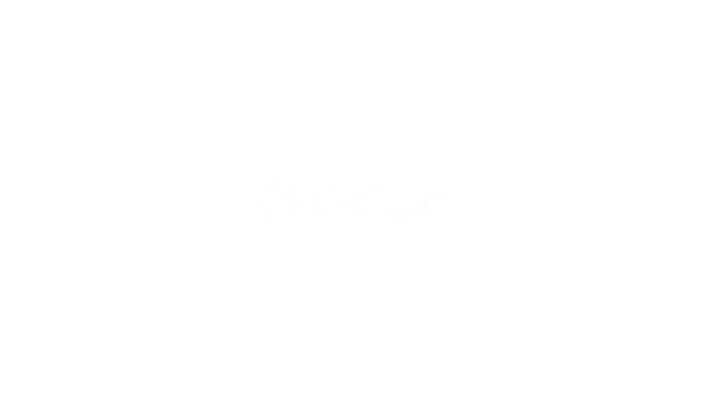
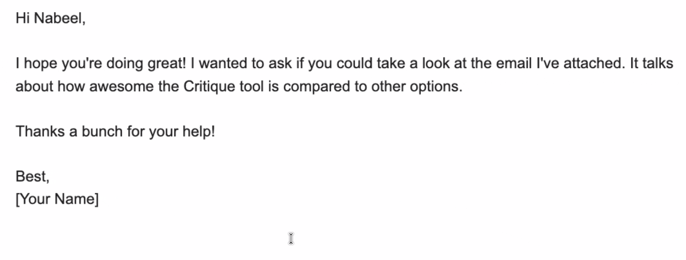
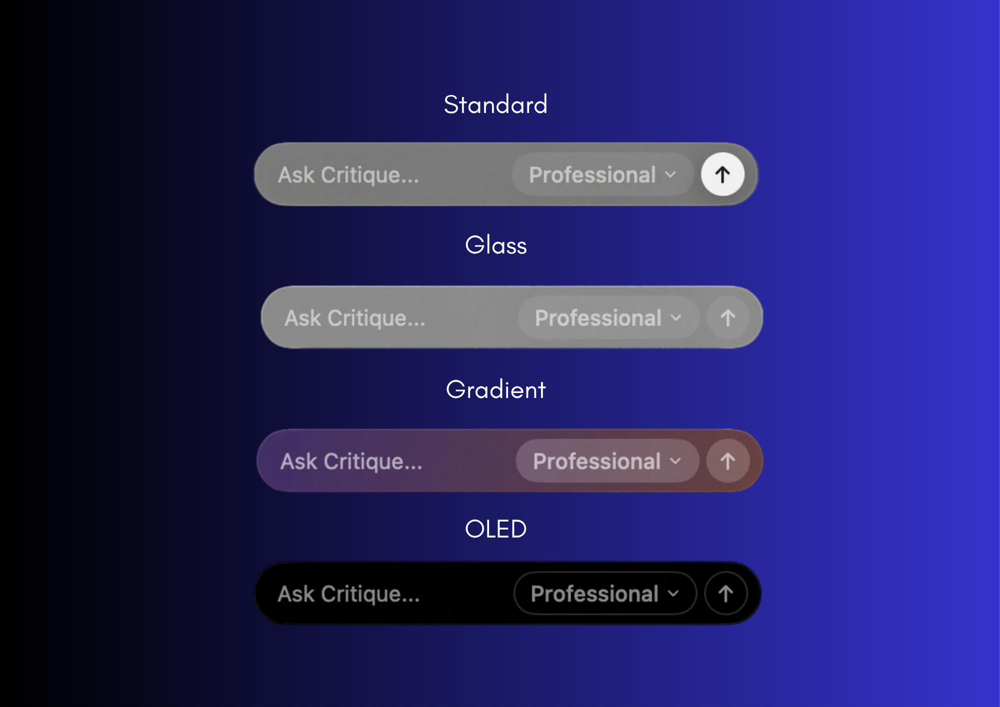
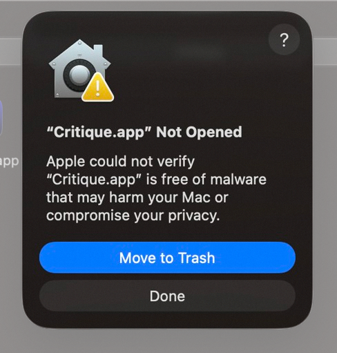
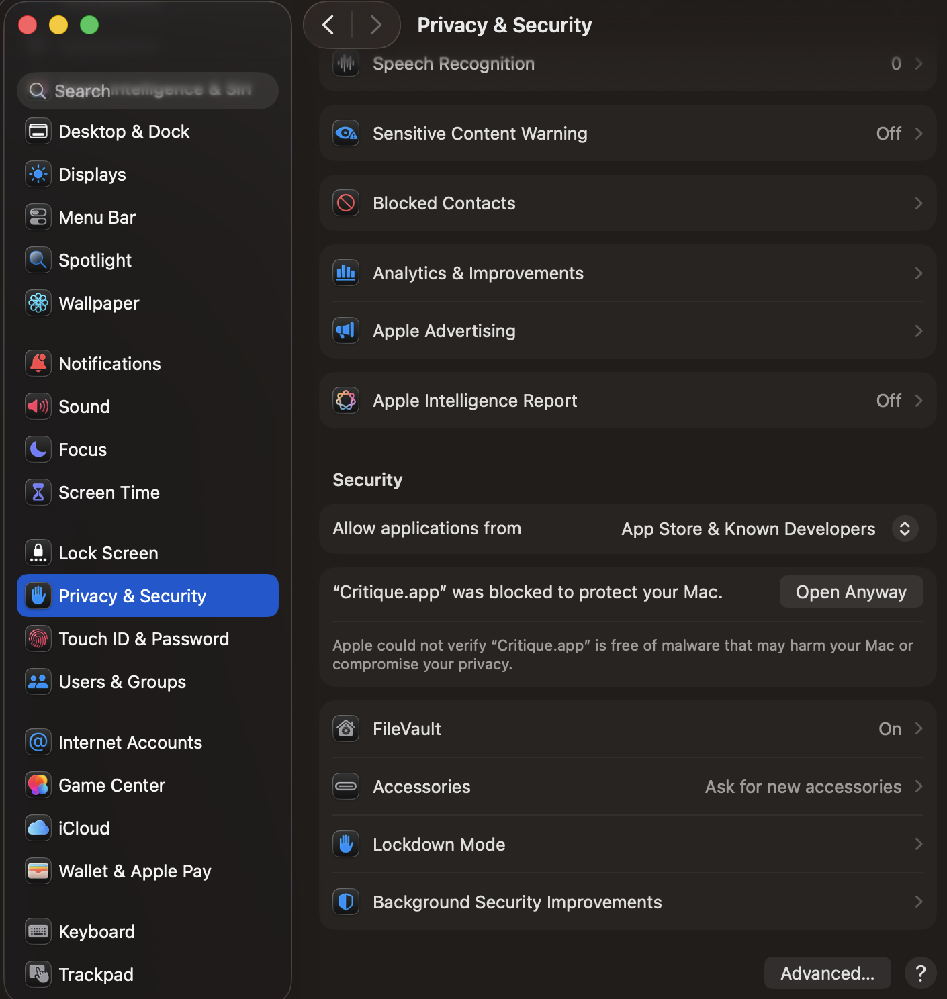

  <picture>
    <source media="(prefers-color-scheme: dark)" srcset="docs/assets/logo-light.png">
    <source media="(prefers-color-scheme: light)" srcset="docs/assets/logo-dark.png">
    
  </picture>
  
<em style="display: block;">AI writing superpower for macOS</em>

  

    
    
    
  

Minimal, fast, and private text transformation for macOS. A lightweight, distraction-free writing assistant with native MLX support and a refined UI — built on WritingTools with major performance and stability improvements.

  

---

## Highlights

- **Surgical Text Transformation**: Select text anywhere and invoke Critique with your hotkey. Your text is instantly replaced with the AI-optimized version.
- **Truly Native**: Built in Swift/SwiftUI. Uses ~0% CPU when idle and remains responsive even under load.
- **Privacy-First**: No data collection. Use local models for 100% on-device processing.
- **Rich Text Aware**: Proofread preserves RTF formatting (bold, italics, etc.) so your documents stay styled.
- **Customizable**: Create your own "tones" with custom instructions and shortcuts.

---

## Personalization

Critique evolves the native writing tool experience with deep UI flexibility, allowing it to adapt to your specific workflow.

- **Dynamic Layouts**: Switch between the traditional **Grid View** or the modern **Toolbar Layout** that places controls exactly where your eyes are.
- **Adaptive Visuals**: Tailor the interface density by choosing to show **Icons**, **Labels**, or **Both** for your interaction buttons.
- **One-Click Optimization**: Set a **Default Tone** to bypass menus. Select text, hit your hotkey, and click the primary action for immediate results.

  

---

## Quick Start

1. **Download** the latest `.dmg` from [Releases](https://github.com/prxshetty/Critique/releases).
2. **Install** by dragging **Critique.app** into your Applications folder.

> **Security Note (macOS Gatekeeper)**  
> Because Critique is currently in early development and not yet notarized by Apple, macOS will block it from opening initially.
>
> 

>   
> 

>
> **To resolve this:**  
> - **Method A:** **Right-click** (or Control-click) the app in your Applications folder and select **Open**, then click **Open** again in the dialog.  
> - **Method B:** Go to **System Settings > Privacy & Security**, scroll down to the **Security** section, and click **Open Anyway**.
>
> 

>   
> 

3. **Permissions**: Grant **Accessibility** access (required to read/replace text).
4. **Setup**: Choose your provider in Settings:
   - **Cloud**: OpenAI, Google (Gemini), Anthropic, Mistral, OpenRouter.
   - **Local**: **Apple Intelligence**, **MLX** (on-device), or **Ollama**.

> [!IMPORTANT]
> **System Requirements:**
> - **macOS 14.0+** is required for Accessibility API features.
> - **macOS 15.4+** is required for native **Apple Intelligence** features.
> - **Apple Silicon** is recommended for MLX on-device inference.

---

## Providers & Models

Critique lets you mix & match based on your needs:
- **Local (Privacy)**: Use **Apple Intelligence** or **MLX on Apple Silicon** for low-latency, on-device inference.
- **Cloud (Power)**: Use GPT-5, Claude 4.6, or Gemini Pro for complex tasks.
- **OpenAI-Compatible**: Seamlessly connect to **Ollama** or other local servers.

---

## License & Credits

Critique is distributed under the GNU General Public License v3.0.  
*Based on the [WritingTools](https://github.com/theJayTea/WritingTools) project.*

---
